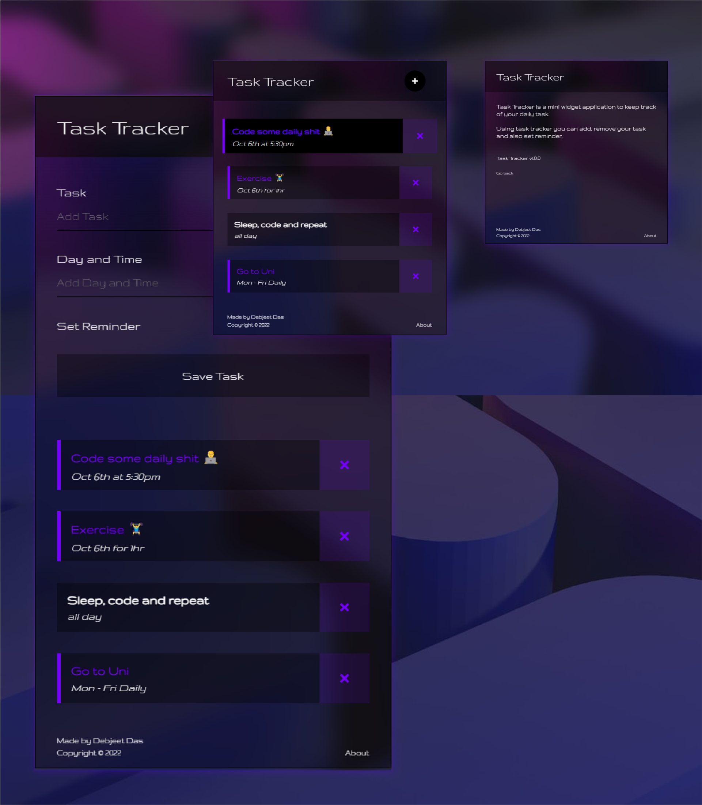

# <strong style="color:#ffffff;">Task</strong> Tracker.
 

Task Tracker using React, check it out... 👇👇 
Made in nodejs, React, HTML, CSS, and jquery.

Task Tracker is a mini widget application to keep track of your daily task. Using task tracker you can add, remove your task and also set reminder.

 
<!-- Website: https://dasdebjeet.github.io -->

## How to setup

Clone the project:

    https://github.com/dasdebjeet/task_tracker.git

## How to run

To install all the requirements for the project run (http://localhost:3000)

	npm install

To run the JSON server (http://localhost:9090/tasks)

	npm run server

 

 

**Made with </> by <a href="https://dasdebjeet.github.io">DebjeetDas</a>. © 2022 all rights reserved.** 
*Author: Debjeet Das*